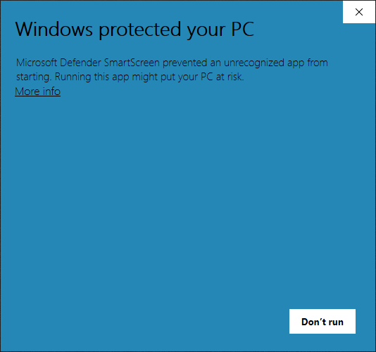
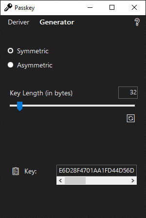
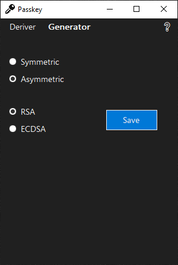

# Passkey

A Windows desktop app for computing cryptographic keys.

## Table of Contents

1. [Getting Started](#getting-started)
2. [Guide](#guide)
3. [Technologies](#technologies)

## Getting Started

<details>
<summary><strong>Run from executable</strong></summary>

1. Download [Passkey-x64.exe]() or [Passkey-x86.exe]() depending on your architecture.

   | File            | SHA-256 |
   | --------------- | ------- |
   | Passkey-x64.exe | ``      |
   | Passkey-x86.exe | ``      |

2. Double-click the executable, click "More info", and then click "Run anyway". This prompt will disappear the next time it's run.

   

</details>

<details>
<summary><strong>Run from source code</strong></summary>

1. Download the .NET SDK from Microsoft's website <a href="https://dotnet.microsoft.com/download"> here</a> or verify installation by running the following command:

   ```bash
   dotnet --version
   ```

2. Navigate to Passkey/WinFormsUI/ and launch with the following command:

   ```bash
   dotnet run
   ```

</details>

## Guide

### Deriver Panel

The Deriver panel allows a key of variable length to be derived from a password using the PBKDF2 algorithm.

- **👁**: reveals the password.
- **Key Length (in bytes)**: the desired length of the key in bytes.
- **Slider**: adjusts the key length.
- **Iterations**: sets the number of iterations in the derivation.
- **Algorithm Dropdown**: sets the hashing algorithm.
- **Salt**: adds a randomly generated salt to the password before derivation.
- **🔄**: generates a new random salt and recomputes the key.
- **📋**: copies a value to the clipboard.
- **❔**: opens the README on GitHub.


### Generator Panel

The Generator panel allows creation of a symmetric or asymmetric key pair using the RSA or ECDSA algorithms.

#### Symmetric Panel

- **Key Length (in bytes)**: the desired length of the key in bytes.
- **Slider**: adjusts the key length.
- **🔄**: recomputes a new key.
- **📋**: copies a value to the clipboard.



#### Asymmetric Panel

- **🔄**: recomputes a new key pair.
- **📋**: copies a value to the clipboard.



## Technologies

- **OS**: Windows
- **IDE**: Visual Studio
- **Language**: C#
- **Framework**: .NET
- **UI**: Windows Forms
- **Version Control**: Git / GitHub
- **Algorithms**: PBKDF2, RSA, ECDSA, SHA1, SHA256, SHA384, SHA512
- **Unit Tests**: xUnit
